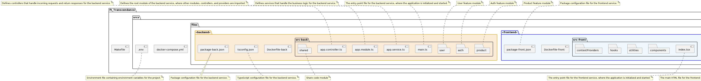

# 🌐 ft_transcendase 🌐

ft_transcendase is a project that utilizes 🐳 Docker and Docker Compose to manage multiple services including a backend, frontend, a database, and an nginx server. The project uses Docker to package the application and its dependencies into a standardized unit for software development and deployment, while Docker Compose is used to manage multi-container Docker applications.

## 📦 Docker Compose 📦

Docker Compose is used to define and run multi-container Docker applications. It uses YAML files to configure the application's services and allows the user to start all services with a single command.

Our `docker-compose.yml` file defines 4 services:

1. **Backend:** 📡 A Node.js server that serves our API.
2. **Frontend:** 🖥️ A React application for the client-side of our application.
3. **Database:** 🗄️ A PostgreSQL server for our data storage.
4. **Nginx:** 🌍 An Nginx server that serves our frontend and proxies our backend.

## 📁 File structure
[](http://www.plantuml.com/plantuml/png/fLRXRjis4Fxlfo2wlwaUm2kAfkdM5bY2Oicm0SKmqDJ9kfewAkJHJJRqtKTIvYGnycAZ3c3fZjzzTqT-FEUDOsdPTtgrMlLIxUGMn8k6_xgpafm2gYKfU27-MQq-NyiTDAZXJo6ToCOaobdb8bA4p-VQg1tObyfqlN5GFNOwXRrBxgl1Eo0he7rQ-udsg-GQwmW9CcNwD4RNOCMhLvi00QfVlnO_N1BZlOVVMsJuKIF1-dr4qQ-cJcQr2UQ48oKTweZyBoDLoZ_wtWRN77yeAO6hByvGYlYKl0jmTifGWziHUdVmp73JhKlKkTSPcUpxAWIpDLg3hTWbmik-l_hFkHpKcTfhc0HS9ySos87TevgYRvDd0Tv9f8ox3kyb8X-J3vn1EENgjsDuwRbTmejZ0RqD3Ia-9uThfONwsOZH-lPKV8qrn5bz6XMyrVuWlVpshEeIHo6xdwDlMNS9NWgl32WLbO8M9OLKmqF5xY6nVOpMiGrBDvY0s9sppPvH8oEuiywpDMPtLffuBU21Frcpns2xay-rsAtURpIg_zcgbZizxjM7O9qk5zeYFGIj1B7SUzb9YtHGo-tkSIwOetf9kMyYqUYROsjefDSS9qKpeg-2DQyjVCU_5Ha6iJ7CfXEcYSDt7R_G6kg0MCGCQNyb4j9Mm6HjBotAZGONchI2MuWtyGiehahQoOHSPqCCaz1RoMXeI9Hv3dDTv6bKykKnkXPtZptSAeizdy_7fWzayn6w5k-WGG8dnbdh0eTaqKgg0oUICbtS2Wlt7Xmx4Vp1O6yfF5nlo84xCNKUncFQ66EDOT6bXO1QehaGNrkmOPN3um1r5zEQBr9PVRuIGWOqThsn37LHH9xnOnKvpRppL8Tt4U24DbjK9tMPVXp2IGKO4Dj7qHiaBWzegRsq9FjUeneE5Pr0GaQfyM-eKuUEvPEMPeFn9C7bMNvKSUd2FzD48ld-BigqQSuCgJk993xSNV_oV69KRJB1nId0PTt6bcMLkSV9iHPNopjty_xZpHyvMNsGJck-9kgKt1wquvvUcqg8CkFmgopMuZQ-26LgoDTWThm-S0VKR_7HW6Hlbt7ISxiMb-6xW4rH-T-7e9FXfSIktW3LljF_0W00) 

## 🛠️ Makefile 🛠️

The Makefile provides a simplified interface to manage Docker and Docker Compose commands.

Here is a brief description of the available commands:

- `make refresh`: 🔄 **I put this one in the first place beause it is the one we are going to use the most each time we integrate \
something in the app**, this command rebuild `frontend` and `nginx` container, also the volume they are sharing.
- `make up`: 🔼 Builds and starts the Docker Compose environment.
- `make build`: 🏗️ Builds the Docker Compose services.
- `make volumes`: 📁 Creates directories for volume data.
- `make check-docker`: ✅ Checks if Docker daemon is running.
- `make create`: 🆕 Creates the services without starting them.
- `make show_volumes`: 📋 Lists Docker volumes.
- `make start`: ▶️ Starts the Docker Compose environment.
- `make restart`: 🔄 Restarts the Docker Compose environment.
- `make ps`: 📝 Lists the running Docker Compose processes.
- `make images`: 🖼️ Lists the Docker images related to the Docker Compose environment.
- `make exec`: 💻 Executes an interactive bash shell on a running container.
- `make stop`: ⏹️ Stops the Docker Compose environment.
- `make down`: ⬇️ Stops and removes Docker Compose containers, networks, and volumes.
- `make logs`: 📜 Shows logs from Docker Compose environment.

## 📚 Prerequisites 📚

You need to have Docker and Docker Compose installed on your system to run the application. Please refer to the official Docker and Docker Compose documentation for installation instructions.

## 🚀 How to Use 🚀

1. Clone the repository: `git clone https://github.com/user/ft_transcendase.git`
2. Change to the directory: `cd ft_transcendase`
3. Build and start the Docker environment: `make up`

Once the environment is running, you can access the application at `localhost:80`.

## 👥 Contribution 👥

Please feel free to contribute to this project by opening Issues and submitting Pull Requests.

## 📝 License 📝

This project is licensed under [insert your License here] - see the LICENSE.md file for details.