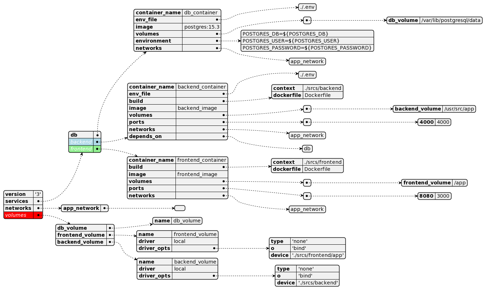
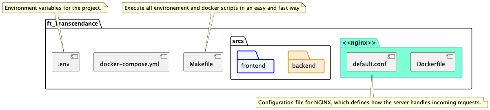

# 🌐 ft_transcendance 🌐

ft_transcendase is a project that utilizes 🐳 Docker and Docker Compose to manage multiple services including a backend, frontend, a database, and an nginx server. The project uses Docker to package the application and its dependencies into a standardized unit for software development and deployment, while Docker Compose is used to manage multi-container Docker applications.

***
## 📦 Docker Compose 📦

Docker Compose is used to define and run multi-container Docker applications. It uses YAML files to configure the application's services and allows the user to start all services with a single command.

Our `docker-compose.yml` file defines 4 services:

1. **Backend:** 📡 A Node.js server that serves our API.
2. **Frontend:** 🖥️ A React application for the client-side of our application.
3. **Database:** 🗄️ A PostgreSQL server for our data storage.
4. **Nginx:** 🌍 An Nginx server that serves our frontend and proxies our backend.

**Docker Structure**
    
***
## 📁 File structure
 

## 🛠️ Makefile 🛠️

The Makefile provides a simplified interface to manage Docker and Docker Compose commands.

Here is a brief description of the available commands:

- `make refresh`: 🔄 Rebuild all `containers`, also the volume they are sharing.
- `make up`: 🔼 Builds and starts the Docker Compose environment.
- `make build`: 🏗️ Builds the Docker Compose services.
- `make volumes`: 📁 Creates directories for volume data.
- `make check-docker`: ✅ Checks if Docker daemon is running.
- `make create`: 🆕 Creates the services without starting them.
- `make start`: ▶️ Starts the Docker Compose environment.
- `make ps`: 📝 Lists the running Docker Compose processes.
- `make images`: 🖼️ Lists the Docker images related to the Docker Compose environment.
- `make stop`: ⏹️ Stops the Docker Compose environment.
- `make down`: ⬇️ Stops and removes Docker Compose containers, networks, and volumes.
- `make logs`: 📜 Shows logs from Docker Compose environment.

## 📚 Prerequisites 📚

You need to have Docker and Docker Compose installed on your system to run the application. Please refer to the official Docker and Docker Compose documentation for installation instructions.

## 🚀 How to Use 🚀

1. Clone the repository: `git clone https://github.com/Noushhhh/42_TRANSCENDANCE.git`
2. Change to the directory: `cd 42_TRANSCENDANCE`
3. Build and start the Docker environment: `make`

Once the environment is running, you can access the application at `localhost:8081`.

## 👥 Contribution 👥

Please feel free to contribute to this project by opening Issues and submitting Pull Requests.

## 📝 License 📝

This project is licensed under [insert your License here] - see the LICENSE.md file for details.
