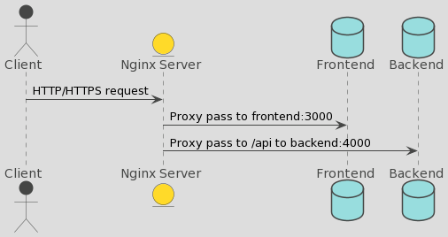
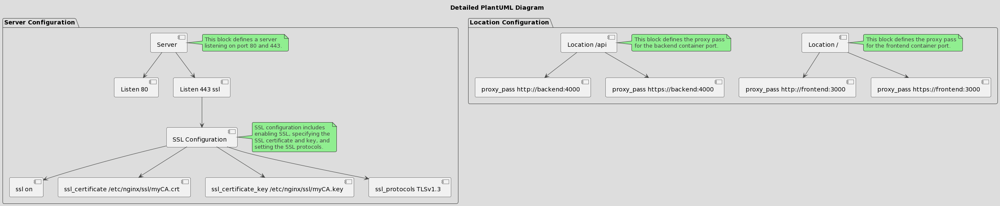

# 🚀 Welcome to the Super Simple Nginx Guide! 🚀

Hello there! 👋 This guide will help you understand how our Nginx server works. Don't worry, we'll make it as easy as pie! 🥧

## 🏗️ What is Nginx?

Nginx (pronounced "engine-x") is a super-duper web server that can also be used as a reverse proxy, load balancer, and HTTP cache. It's like a multi-tool Swiss Army knife for the web! 🛠️

## 📦 Docker and Nginx

We're running Nginx inside a Docker container. Docker is like a magic box 🎁 that lets us run our software reliably across different machines. Our Docker container is built from an Ubuntu image, and we install Nginx and OpenSSL on it. OpenSSL is used for creating SSL certificates for secure connections 🔒.

### 😀 nginx diagrame 

***

## 🎛️ Nginx Configuration

Our Nginx server listens to two ports: 80 and 443. Port 80 is for HTTP (the regular, unsecured web traffic) and port 443 is for HTTPS (the secure, encrypted web traffic). It's like having two doors 🚪 to our server - one regular door and one super-secure door!

We have two main paths in our server:

1. `/` (the root path) 🏠: This is like the front door of a house. When a request comes to this path, it's sent to our frontend service running on port 3000.
2. `/api` 🧪: This is like the back door of a house, leading to the lab. When a request comes to this path, it's sent to our backend service running on port 4000.

## 🔒 SSL Configuration

We care about security! That's why we use SSL (Secure Sockets Layer) for connections on port 443. We have an SSL certificate and key stored in `/etc/nginx/ssl/myCA.crt` and `/etc/nginx/ssl/myCA.key` respectively. It's like having a special ID and key 🔑 for the secure door!

### Diagrame explaining Nginx and SSL configuration

***

## 📜 Dockerfile

Our Dockerfile is like a recipe 🧾 that tells Docker how to build our container. It includes steps like installing Nginx and OpenSSL, removing the default Nginx configuration, and replacing it with our custom configuration. It also generates an SSL key and certificate, and exposes ports 80 and 443.

## 🎉 That's it!

And there you have it! You now know how our Nginx server works. Remember, it's like a house 🏠 with two doors and a secure ID for the secure door. And Docker is our magic box that makes sure everything runs smoothly. Happy exploring! 🕵️‍♀️🎉

Remember: Always be curious, and never stop learning! 🚀🌟