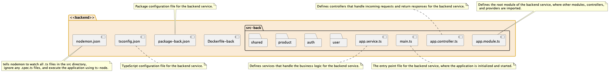

# Backend

📦 Version: 1.0.0

## Description

This is the backend application for the project.

## Main File

- Main: `src/main.ts`

## Scripts

- Prestart: `tsc`
  - ✨ Utility: Executes the TypeScript compiler (tsc) before starting the application.
  
- Start: `nest start`
  - ✨ Utility: Starts the application using the NestJS framework's CLI command.

- Test: `echo "Error: no test specified" && exit 1`
  - ✨ Utility: Used for running tests. It echoes an error message and exits with an error code.

## Dependencies

- "@nestjs/cli"
  - ✨ Utility: NestJS CLI - Development tool for generating and managing NestJS applications.

- "@nestjs/common"
  - ✨ Utility: Provides common utilities and decorators used in NestJS applications.

- "@nestjs/core"
  - ✨ Utility: Core module of NestJS that provides the runtime engine and application context.

- "@nestjs/platform-express"
  - ✨ Utility: Integrates NestJS with Express, a popular web framework for Node.js.

- "@nestjs/typeorm"
  - ✨ Utility: NestJS integration with TypeORM, an Object-Relational Mapping (ORM) library for TypeScript and JavaScript.

- "typeorm"
  - ✨ Utility: Flexible and powerful ORM for TypeScript and JavaScript.

- "pg"
  - ✨ Utility: PostgreSQL client library for Node.js. Allows the application to connect to and interact with a PostgreSQL database.

- "reflect-metadata"
  - ✨ Utility: Provides a way to add and read metadata to/from TypeScript classes and their properties.

- "rxjs": "7.8.1"
  - ✨ Utility: Reactive Extensions for JavaScript (RxJS) - Library for composing asynchronous and event-based programs.

- "serve-static"
  - ✨ Utility: Middleware for serving static files in Express applications.
## devDependencies
- "nodemon"
  - ✨ Utility: Is a tool to develop node.js application by automatically restarting the node application when file changes are detected in the directory. 
- "ts-node"
  - ✨ Utility: Is a TypeScript execution engine, transforms TypeScript into javaScript, enabling you to directly execute TypeScript in node.js 

***

## 🏗️ Structure

**Here's an overview of our main directories and files:**

* This file organization makes it clear where different types of files should be, making the project easier to navigate and maintain.

**Our project is structured in a feature-based fashion to make things as easy as possible. Here's what that means:**  

**User Module 👥**: All things related to users, such as registration and profile editing.

**Auth Module 🔒**: Responsible for authentication, handling tasks such as login and JWT handling.

**Products Module 🛍️**: Responsible for the handling of product data, such as creating, updating and deleting products.

**Shared Module 🔄**: Contains reusable pieces of code that are used across multiple modules.

* Each feature has its own directory `(user, auth, products)`. This keeps all related files together and separate from unrelated files, which makes the codebase easier to understand and maintain.

* Each feature `module` has its own `.module.ts, .service.ts, .controller.ts`, and `.entity.ts` files. This adheres to the principles of NestJS's modular architecture.

* There's a `shared directory` for code that's used by multiple feature modules. This reduces duplication and makes it easier to update shared code.

***

# 📚 Vocabulary

* In this section, you'll find explanations for some of the key terms used throughout our project:

**Auth 🔒**: Auth stands for authentication and authorization. Authentication is the process of verifying who a user is, while authorization is the process of verifying what they have access to. For example, users might need to provide a username and password (authentication) to access their account page (authorization).

**Controller 🕹️**: In a NestJS application, a controller handles HTTP requests. It's like a traffic controller for incoming client requests and outgoing server responses. For example, a product controller might handle GET requests to view a product and POST requests to create a new product.

**CRUD 📝**: CRUD stands for Create, Read, Update, and Delete. These are the four basic operations that can be performed on any data. For example, in our application, users might be able to create a new account (Create), view their account details (Read), update their password (Update), and delete their account (Delete).

**JWT 🎟️**: JWT stands for JSON Web Token. This is a compact, URL-safe means of representing claims to be transferred between two parties. It's commonly used for authentication and information exchange. For example, once a user logs in, the server might return a JWT that the client can use to prove that they are logged in for subsequent requests.

**Module 📦**: In a NestJS application, a module is a class annotated with a @Module() decorator. A module brings together controllers, services, and other modules to organize the application structure. For example, our user module groups together everything related to users.

**Service 🛠️**: In a NestJS application, a service is a class that does something useful and can be injected as a dependency into controllers, other services, etc. For example, a userService might have methods to get a user by ID, create a new user, etc.